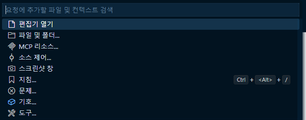

# AI 를 활용한 배포 자동화 회고

내가 개발하는 어플리케이션은 매달 말 일에 배포되고 있다.  
배포는 평균 30분 정도 소요되는데, 절반은 빌드 시간, 절반은 매뉴얼 및 릴리즈 노트 등 문서 작성에 쓰인다.  
어플리케이션이 웹버전과 Windows 앱버전 두가지로 나뉘어, 배포 과정이 긴 편이다.

배포 과정은 대충 아래와 같다.

### 배포 과정

1. 매뉴얼 이슈 Merge
1. 버전 업데이트 이슈 Merge
1. 웹 버전 빌드
1. 빌드 결과를 zip 파일로 압축
1. 배포 서버에 배포  
   (도커를 쓰지 않고 서버에서 node 로 앱을 바로 실행시키고 있다. 이것 역시 도커로 배포하는 것이 목표...)
1. 도커 이미지 빌드
1. 도커 이미지를 Nexus 레포지토리에 push
1. Windows App 버전 빌드
1. Windows App 아티팩트(\*.exe)를 다운로드 사이트에 배포
1. Windows App 아티팩트(\*.exe) 를 zip 파일로 압축
1. zip 파일들을 Dooray Wiki 에 업로드
1. 매뉴얼 서버에 매뉴얼 배포 (매뉴얼 아티팩트는 3 에서 생성된다.)
1. Dooray 단톡방에 적용된 이슈들을 종합 정리하여 배포 완료 메신저 전송
1. 릴리즈 노트 이메일 전송

 

쓰고 보니 아주 길군... -\_-;;  
내가 개발하는 앱은 마이크로 서비스여서 여러 서비스에 임베드된다.  
어떤 환경에서 사용될지 모르기 때문에 빌드 산출물과 도커 이미지 파일을 모두 배포한다.  
자체 관리하는 앱도 함께 배포 중이다.

2,3,4 번은 자바스크립트로 자동화를 해둔 상태이다.  
6, 7 번은 쉘 스크립트로 자동화를 했다.  
12 번은 후임을 시켜 하고 있고,  
13번은 Dooray API 와 GitLab API 를 활용하여 자동화를 했다.  
물론 실행은 수동으로 해야한다.

지금은 익숙해져서 물 흐르듯이 후다닥 진행할 수 있지만,  
가끔 놓치는 것도 있고, 무엇보다 귀찮다.

또한, 최근 다녀온 AI 컨퍼런스에서 "딸깍"에 굉장한 영감을 받아서 너무너무 자동화를 하고 싶었다.  
얼마나 자동화를 할 수 있을진 모르겠지만, 최대한 덜 일할 수 있는 것을 목표로 한다.

## 매뉴얼, 버전 업데이트 이슈 자동화

버전 업데이트는 항상 같은 파일에서 숫자만 바꾸면 되는 단순 노동이다.  
하지만 정신 놓고 다니다 보니 가끔 수정해야할 곳을 놓치기도 한다.

매뉴얼은 조금 귀찮은데, 지금까지 merge 된 이슈들의 내용을 종합하여 릴리즈 노트를 작성하는 과정이다.  
릴리즈 노트가 매뉴얼 페이지에 포함되어 배포되기 때문에 매뉴얼이라고 대충 칭하고 있다.

버전이나 매뉴얼은 항상 포맷이 같고 같은 곳을 수정하니까, AI 에게 어떤 부분을 무엇으로 수정해야할 지 알려주고, 자동화하면 되겠다고 생각했다.

개발 환경이 VSCode 이고, 팀 내에서 Copilot 을 사용하고 있기 때문에 최대한 활용했다.

### GitLab MCP Server 활용

LLM 에게 Merge 된 GitLab 이슈 및 업데이트 해야할 버전을 알려주기 위해서 [@zereight/mcp-gitlab](https://github.com/zereight/gitlab-mcp)를 사용했다.

마일 스톤을 버전 명으로 하여 개발하고 있기 때문에,  
가장 최근에 merge 된 이슈의 마일 스톤을 업데이트할 버전 명이라고 알려주고,  
해당 마일 스톤을 가진 merge 된 이슈들을 가져오도록 했다.

### VSCode Copilot Context 활용

VSCode Copilot 은 여러 형태의 컨텍스트를 LLM 에게 제공한다. ([참고 - VSCode 공식 문서](https://code.visualstudio.com/docs/copilot/chat/copilot-chat-context#_implicit-context))

여기서 "소스 제어" 를 활용하면 Git 커밋을 LLM 에게 컨텍스트로 제공할 수 있다.

그간 이 전 버전에서 작업했던 매뉴얼 이슈 커밋과 버전 업데이트 이슈 커밋을 컨텍스트로 여러개 제공하고,
이런 형태를 따르면 된다고 LLM 에게 알려줬다.

### 결과

> (참고할 유사한 Git 커밋을 컨텍스트로 제공하고, GitLab MCP Server 를 연동한 상태)  
> "나는 매뉴얼과 버전을 업데이트 하려고 하고 있어.  
> 가장 최근에 Merge 된 이슈의 마일 스톤이 업데이트 버전이야.  
> 해당 마일 스톤을 가지고 있는 Merged 이슈들을 기반으로 매뉴얼을 작성해줘.  
> 그리고 버전을 업데이트 해줘."

결과는 성공적이었다.  
이 전에 작성한 이슈들과 같은 부분에서 버전을 업데이트 했고,  
Merge 된 이슈를 기반으로, 기존과 같은 포맷의 릴리즈 노트를 생성/작성했다.

매뉴얼에 추가하고 싶은 부분은 내가 일부 채워 넣고,  
거의 수정하지 않은 채 바로 머지하고 배포했다.

### 프롬프트 시도

컨텍스트를 제공하는 것이 좀 귀찮아서, (심지어 자연어를 입력하는 것까지 좀 귀찮...)  
프롬프트로도 시도해봤다.

VSCode Copilot 은 프롬프트를 LLM 에게 컨텍스트로 제공할 수 있다. ([참고 - VSCode 공식 문서](https://code.visualstudio.com/docs/copilot/customization/prompt-files))

> 당신의 목적은 OO 프로젝트의 매뉴얼과 버전을 업데이트 하는 것입니다.  
> GitLab 과 관련된 작업은 GitLab MCP Server 의 Tool 로 수행하세요.  
> 업데이트 버전은 가장 최근에 Merge 된 이슈의 마일 스톤입니다.  
> "업데이트 버전" 이라는 커밋 명을 포함하는 최신 커밋 3개를 가져오세요.  
> 가져온 커밋을 참고하여 버전을 업데이트하세요.  
> "업데이트 매뉴얼" 이라는 커밋 명을 포함하는 최신 커밋 3개를 가져오세요.  
> 가져온 커밋을 참고하여 업데이트 버전 마일 스톤을 가지고 있는 Merged 이슈들을 기반으로 매뉴얼을 작성하세요.

결론적으로 유사한 결과를 얻을 수 있었지만, 좀 오래 걸렸다.  
여러번 시도해봤는데, 짧게는 3분 정도 걸린다.  
그리고 완료되는 것을 계속 지켜보고 있어야한다.  
어떤 과정을 시도할 때마다 LLM 이 나에게 확인을 받고, '계속' 버튼을 눌러야 다음 과정이 진행되기 때문에...

불안해서 과정을 지켜보지 않을 수도 없다.
가끔 엉뚱한 행동을 할 때도 있어서 ^\_^;;

너무 한번에 많은 것을 요구하는 프롬프트여서 체감상 오래 걸리는 것도 있었고,  
컨텍스트로 제공했던 커밋을 MCP 서버로 일일이 읽어오는 과정이 필요했기 때문에 좀 오래 걸린 것 같다.

### 결론

컨텍스트와 MCP Server를 적절히 활용하여 매뉴얼과 버전 업데이트를 자동화하는 것은 유용한 것 같다.  
특히 릴리즈 노트는 많은 이슈를 종합/요약해야하기 때문에, AI 의 도움이 크다.  
하지만 단순 버전 업데이트는 컨텍스트를 첨부하고 자연어를 쓸 시간에 내가 후딱 업데이트 하는 것이 더 빠르고 정확한것 같다.  
업데이트할 버전 같은 것도 그냥 마일 스톤에서 찾게하지 말고, 자연어로 걍 알려주는게 더 빠르다.

<b>컨텍스트 첨부 + 자연어로 명령 전달 + LLM 이 만든 결과를 검증</b>  
위 삼단 콤보의 소요 시간이 과연 무엇을 위한 자동화인가... 이게 자동화인가? 하는 현타를 느끼게 했다.

결론적으로 참고할만한 컨텍스트를 LLM 에게 제공하고,  
버전과 같은 간단한 정보는 자연어로 제공하고,  
타이핑하기 귀찮은 자연어는 미리 만들어둔 프롬프트로 재활용하는 것이 가장 효율적인 것 같다.

앞으로 이 방법을 계속 사용하기 위해선 각 이슈의 커밋 명도 잘 정리해두는 것이 중요하겠다.

## 릴리즈 노트 이메일 자동화

계획은 이렇다.

1. 배포에 적용되는 이슈 제목들 가져오기
1. 1 번과 함께 지난 버전에서 작성된 릴리즈 노트 content 를 AI 에게 컨텍스트로 제공
1. AI 에게 릴리즈 노트 content 를 markdown 으로 만들 것을 명령
1. AI 결과 markdown 을 메일로 전송
