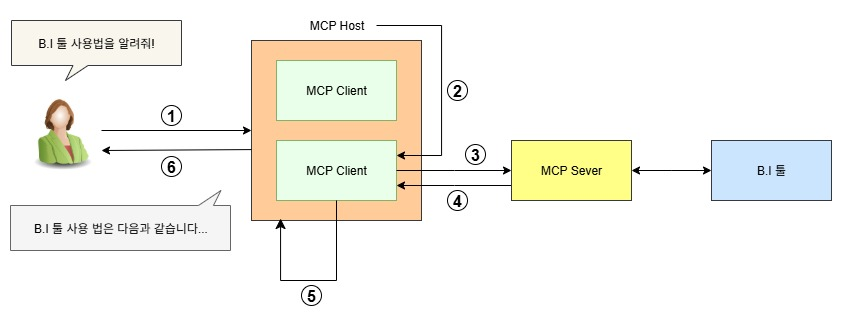

# MCP 서버 구현기 (1)

나는 B.I (Business Intelligence) 툴 개발자이다.  
개발 중인 B.I 툴에 MCP 서버를 도입하게 되어, MCP 서버를 구현하는 과정을 기록해본다.

## 목표

AI 에게 우리 B.I 툴 사용법에 대해 물었을 때 AI 가 사용법을 답변을 해주고,  
AI 에게 "○○한 대시보드를 만들어줘" 라고 요청했을 때, AI 가 우리 B.I 툴로 대시보드를 만들어주는 것을 목표로 한다.

## MCP 란?

내가 개발 중인 작은 B.I 툴을 AI 가 알리가 만무하다.  
그렇다면, AI 가 우리 B.I 툴에 대해 알 수 있도록 정보를 주어야 한다.  
AI 가 우리 B.I 툴에 대해 알 수 있도록 정보를 줄 수 있게 하는 것이 바로 MCP 서버이다.

MCP 서버에서 MCP 란 무엇일까?

<b>MCP (Model-Context Protocol)</b>

- Model
    - AI 의 두뇌를 의미한다. 대표적인 예로, GPT, Claude, Gemini 등이 있다.
- Context
    - 대화나 입력된 글의 문맥을 의미한다.
    - 모델이 무슨 말을 해야할지 결정하기 위해 참고하는 현재까지의 대화 내용이다.
    - 컨텍스트는 일정한 토큰 수(말 뭉치 단위)까지 기억할 수 있다.
- Protocol
    - 통신 규약, 즉 규칙 또는 약속이다.

이어 붙여보면, "AI 문맥 규약"이라는 뜻이 된다.

위키피디아는 이렇게 설명하고 있다.

::: warning [Wikipedia](https://ko.wikipedia.org/wiki/%EB%AA%A8%EB%8D%B8_%EC%BB%A8%ED%85%8D%EC%8A%A4%ED%8A%B8_%ED%94%84%EB%A1%9C%ED%86%A0%EC%BD%9C)
모델 컨텍스트 프로토콜(Model Context Protocol, MCP)은 인공지능 회사 앤트로픽이 대규모 언어 모델(LLM) 애플리케이션이 외부 도구, 시스템 및 데이터 소스와 상호 작용할 수 있도록 개발한 개방형 표준이다.
:::

쉽게 설명하면, MCP 는 <u>AI 모델이 외부 도구를 이해할 수 있도록 문맥 정보를 주고받는 규칙</u>이다.  
즉, 내가 개발 중인 B.I 툴과 같은 외부 도구를 AI 가 인지/이해할 수 있게 하는 절차나 규칙을 의미한다.

## MCP 는 왜 생겼고, 왜 사용하는가?

MCP 는 결국 통신 규약, 즉, 약속이다. 이러한 약속은 왜 세운 것일까?

MCP 가 있기 전에는, 내가 개발 중인 B.I 툴과 같은 외부 도구에 AI 를 활용하려면  
외부 도구가 AI 와 연동 될 수 있도록 개별적인 연동 코드를 구현해야했다.

개별적인 연동 코드를 구현하는 것은 시간과 비용이 많이 들고,  
각기 다른 연동 방식은 보안 취약점을 만들고 관리를 복잡하게 만들었다.

MCP 는 이러한 문제를 해결하기 위해 만들어졌다.

MCP 는 AI 모델과 외부 도구 간의 통신을 표준화하여,
개발자들이 AI 모델과 외부 도구를 쉽게 통합할 수 있도록 한다.

MCP 개발 가이드는 MCP 를 USB 에 비유하고 있다.

::: warning [MCP](https://modelcontextprotocol.io/docs/getting-started/intro)
MCP는 AI 애플리케이션을 위한 USB-C 포트라고 생각하면 됩니다.  
USB-C가 다양한 주변 기기 및 액세서리에 기기를 연결하는 표준화된 방식을 제공하는 것처럼, MCP는 AI 모델을 다양한 데이터 소스 및 도구에 연결하는 표준화된 방식을 제공합니다.
:::

그렇다면 어떻게 쉽게 통합할 수 있게 한다는 것일까?  
이를 이해하려면 MCP 의 구조를 알아야한다.

## MCP 의 구조

MCP 는 크게 세 가지 핵심 구성 요소로 이루어져 있다.

1. MCP Host
    - MCP Host는 사용자와 직접 상호작용하는 애플리케이션이다.
    - 대표적으로 Claude Desktop, Cursor, JetBrains AI Assistant, Zed Editor, Sourcegraph Cody, Visual Studio Code 등이 있다.
    - MCP Host 는 MCP Client를 내장하고 있다.
    - 하나의 MCP Host 는 여러 개의 MCP Client를 내장할 수 있다.
1. MCP Client
    - MCP Client는 MCP Host와 MCP Server 사이의 중개자 역할을 한다.
    - MCP Host를 대신하여 MCP Server와 통신하고, 프로토콜 메시지를 처리하며, MCP Server로 부터 받은 리소스를 MCP Host에게 제공한다.
    - MCP Server와 1:1 연결된다.
1. MCP Server
    - MCP Server는 실제 기능과 리소스를 제공하는 서버이다.
    - 우리 B.I 툴과 같은 외부 도구의 DB, API 와 같은 리소스에 MCP Client가 접근할 수 있도록 노출한다.
    - 내가 구현해야할 부분이 바로 이 MCP Server이다.

## MCP 의 흐름

이 세 가지 구성요소는 어떤 식으로 상호작용 하는지 MCP 의 흐름을 살펴보자.

1. 먼저 사용자가 MCP Host 에게 요청을 보낸다.  
   예를 들면, 사용자가 Cluade Desktop 을 실행 시키고 "B.I 툴 사용법을 알려줘" 라고 입력한다.
2. MCP Host 는 이 요청을 MCP Client 에게 전달한다.  
   단순히 요청을 전달하는 것을 넘어, 사용자의 이전 대화 내용, 현재 작업 중인 문서 내용 등을 파악하여 추가적인 컨텍스트를 MCP Client 에게 전달한다.
3. MCP Client는 사용자의 요청을 처리하는 데 필요한 적절한 MCP Server를 식별한다.  
   식별 후, 선택한 MCP Server로 표준화된 MCP 요청 메시지를 보낸다.  
   이 메시지에는 필요한 데이터의 종류, 도구 호출 시의 매개 변수 등이 포함된다.
4. 요청을 받은 MCP 서버는 해당 요청을 처리한다.  
   처리된 결과를 표준화된 형식으로 MCP Client에게 반환한다.
5. MCP Client는 MCP Server로부터 받은 응답을 MCP Host에 전달한다.
6. MCP Host 는 컨텍스트 정보를 종합하여 최종적인 응답을 생성한다.  
   예를 들면, "B.I 툴 사용법은 다음과 같습니다..." 라고 답변한다.

## MCP 서버 구현

MCP Host 와 MCP Client 는 Claude Desktop 과 같은 AI Assistant 를 다운로드 받아 사용할 수 있다는 것을 알 수 있다.  
우리는 MCP Server 를 구현하고 AI Assistant 와 연결해야 한다.

MCP를 처음으로 공개하고 적극적으로 추진한 Anthropic 는 MCP 서버 구현을 쉽게 할 수 있게 도와주는 SDK 를 제공하고 있다.

[MCP SDKs](https://modelcontextprotocol.io/docs/sdk)

여러 언어를 지원하는 데, 나는 이 중 Javascript(typescript) 를 선택했다.
