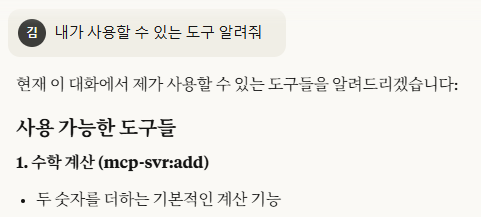

# MCP 서버 구현기 (1)

나는 B.I (Business Intelligence) 툴 개발자이다.  
개발 중인 B.I 툴에 MCP 서버를 도입하게 되어, MCP 서버를 구현하는 과정을 기록해본다.

## 목표

AI 에게 우리 B.I 툴 사용법에 대해 물었을 때 AI 가 사용법을 답변을 해주고,  
AI 에게 "○○한 대시보드를 만들어줘" 라고 요청했을 때, AI 가 우리 B.I 툴로 대시보드를 만들어주는 것을 목표로 한다.

## MCP 란?

내가 개발 중인 작은 B.I 툴을 AI 가 알리 만무하다.  
그렇다면, AI 가 우리 B.I 툴에 대해 알 수 있도록 정보를 주어야 한다.  
AI 가 우리 B.I 툴에 대해 알 수 있도록 정보를 줄 수 있게 하는 것이 바로 MCP 서버이다.

MCP 서버에서 MCP 란 무엇일까?

<b>MCP (Model-Context Protocol)</b>

- Model
    - AI 의 두뇌를 의미한다. 대표적인 예로, GPT, Claude, Gemini 등이 있다.
- Context
    - 대화나 입력된 글의 문맥을 의미한다.
    - 모델이 무슨 말을 해야할지 결정하기 위해 참고하는 현재까지의 대화 내용이다.
    - 컨텍스트는 일정한 토큰 수(말 뭉치 단위)까지 기억할 수 있다.
- Protocol
    - 통신 규약, 즉 규칙 또는 약속이다.

이어 붙여보면, "AI 문맥 규약"이라는 뜻이 된다.

위키피디아는 이렇게 설명하고 있다.

::: warning [Wikipedia](https://ko.wikipedia.org/wiki/%EB%AA%A8%EB%8D%B8_%EC%BB%A8%ED%85%8D%EC%8A%A4%ED%8A%B8_%ED%94%84%EB%A1%9C%ED%86%A0%EC%BD%9C)
모델 컨텍스트 프로토콜(Model Context Protocol, MCP)은 인공지능 회사 앤트로픽이 대규모 언어 모델(LLM) 애플리케이션이 외부 도구, 시스템 및 데이터 소스와 상호 작용할 수 있도록 개발한 개방형 표준이다.
:::

쉽게 설명하면, MCP 는 <u>AI 모델(LLM)이 외부 도구를 이해할 수 있도록 문맥 정보를 주고받는 규칙</u>이다.  
즉, 내가 개발 중인 B.I 툴과 같은 외부 도구를 AI 가 인지/이해할 수 있게 하는 절차나 규칙을 의미한다.

::: tip LLM
Large Language Model의 약자로, 대규모 언어 모델을 의미한다.
방대한 양의 데이터로 사전 학습된 초대형 AI 모델이다.
:::

## MCP 는 왜 생겼고, 왜 사용하는가?

MCP 는 결국 통신 규약, 즉, 약속이다. 이러한 약속은 왜 세운 것일까?

MCP 가 있기 전에는, 내가 개발 중인 B.I 툴과 같은 외부 도구에 AI 를 활용하려면  
외부 도구가 AI 와 연동 될 수 있도록 개별적인 연동 코드를 구현해야했다.

개별적인 연동 코드를 구현하는 것은 시간과 비용이 많이 들고,  
각기 다른 연동 방식은 보안 취약점을 만들고 관리를 복잡하게 만들었다.

MCP 는 이러한 문제를 해결하기 위해 만들어졌다.

MCP 는 AI 모델과 외부 도구 간의 통신을 표준화하여,
개발자들이 AI 모델과 외부 도구를 쉽게 통합할 수 있도록 한다.

MCP 개발 가이드는 MCP 를 USB 에 비유하고 있다.

::: warning [MCP](https://modelcontextprotocol.io/docs/getting-started/intro)
MCP는 AI 애플리케이션을 위한 USB-C 포트라고 생각하면 됩니다.  
USB-C가 다양한 주변 기기 및 액세서리에 기기를 연결하는 표준화된 방식을 제공하는 것처럼, MCP는 AI 모델을 다양한 데이터 소스 및 도구에 연결하는 표준화된 방식을 제공합니다.
:::

그렇다면 어떻게 쉽게 통합할 수 있게 한다는 것일까?  
이를 이해하려면 MCP 의 구조를 알아야한다.

## MCP 의 구조

MCP 는 크게 세 가지 핵심 구성 요소로 이루어져 있다.


1. MCP Host
    - MCP Host는 사용자와 직접 상호작용하는 애플리케이션이다.
    - 대표적으로 Claude Desktop, Cursor, JetBrains AI Assistant, Zed Editor, Sourcegraph Cody, Visual Studio Code 등이 있다.
    - MCP Host 는 MCP Client를 내장하고 있다.
    - 하나의 MCP Host 는 여러 개의 MCP Client를 내장할 수 있다.
1. MCP Client
    - MCP Client는 MCP Host와 MCP Server 사이의 중개자 역할을 한다.
    - MCP Host를 대신하여 MCP Server와 통신하고, 프로토콜 메시지를 처리하며, MCP Server로 부터 받은 리소스를 MCP Host에게 제공한다.
    - MCP Server와 1:1 연결된다.
1. MCP Server
    - MCP Server는 실제 기능과 리소스를 제공하는 서버이다.
    - 우리 B.I 툴과 같은 외부 도구의 DB, API 와 같은 리소스에 MCP Client가 접근할 수 있도록 노출한다.
    - 내가 구현해야할 부분이 바로 이 MCP Server이다.

## MCP 의 흐름

이 세 가지 구성요소는 어떤 식으로 상호작용 하는지 MCP 의 흐름을 살펴보자.


1. 먼저 사용자가 MCP Host 에게 요청을 보낸다.  
   예를 들면, 사용자가 Cluade Desktop 을 실행 시키고 "B.I 툴 사용법을 알려줘" 라고 입력한다.
2. MCP Host 는 이 요청을 MCP Client 에게 전달한다.  
   단순히 요청을 전달하는 것을 넘어, 사용자의 이전 대화 내용, 현재 작업 중인 문서 내용 등을 파악하여 추가적인 컨텍스트를 MCP Client 에게 전달한다.
3. MCP Client는 사용자의 요청을 처리하는 데 필요한 적절한 MCP Server를 식별한다.  
   식별 후, 선택한 MCP Server로 표준화된 MCP 요청 메시지를 보낸다.  
   이 메시지에는 필요한 데이터의 종류, 도구 호출 시의 매개 변수 등이 포함된다.
4. 요청을 받은 MCP 서버는 해당 요청을 처리한다.  
   처리된 결과를 표준화된 형식으로 MCP Client에게 반환한다.
5. MCP Client는 MCP Server로부터 받은 응답을 MCP Host에 전달한다.
6. MCP Host 는 컨텍스트 정보를 종합하여 최종적인 응답을 생성한다.  
   예를 들면, "B.I 툴 사용법은 다음과 같습니다..." 라고 답변한다.

## 예제 MCP 서버 구현

MCP Host 와 MCP Client 는 Claude Desktop 과 같은 AI Assistant 를 다운로드 받아 사용할 수 있다는 것을 알 수 있다.  
우리는 MCP Server 를 구현하고 AI Assistant 와 연결해야 한다.

MCP를 처음으로 공개하고 적극적으로 추진한 Anthropic 는 MCP 서버 구현을 쉽게 할 수 있게 도와주는 SDK 를 제공하고 있다.

[MCP SDKs](https://modelcontextprotocol.io/docs/sdk)

여러 언어를 지원하는 데, 나는 이 중 Javascript(typescript) 로 구현했다.

### MCP 프로젝트 생성

typescript sdk는 node.js 18버전 이상을 지원한다.  
나는 22.18.0 버전을 사용했다.

```shell
mkdir mcp-svr
cd mcp-svr
npm init
```

### SDK install

```shell
npm install @modelcontextprotocol/sdk
```

### MCP 서버 구현

[Typescript SDK README.md](https://github.com/modelcontextprotocol/typescript-sdk) 를 보면 Quick Start 가이드가 있다.  
일단 개념을 정확하게 모르지만, 가이드를 따라 서버를 구현해봤다.

`/src/server.ts` 파일을 생성하고 다음 코드를 작성한다.  
(참고로 가이드 코드 마지막 줄에 쓸 데 없는 `await` 가 붙어있는데 오류가 나서 빼줬다.)

```ts [src/server.ts]
import {
    McpServer,
    ResourceTemplate,
} from '@modelcontextprotocol/sdk/server/mcp.js';
import { StdioServerTransport } from '@modelcontextprotocol/sdk/server/stdio.js';
import { z } from 'zod';

// Create an MCP server
const server = new McpServer({
    name: 'demo-server',
    version: '1.0.0',
});

// Add an addition tool
server.registerTool(
    'add',
    {
        title: 'Addition Tool',
        description: 'Add two numbers',
        inputSchema: { a: z.number(), b: z.number() },
    },
    async ({ a, b }) => ({
        content: [{ type: 'text', text: String(a + b) }],
    })
);

// Add a dynamic greeting resource
server.registerResource(
    'greeting',
    new ResourceTemplate('greeting://{name}', { list: undefined }),
    {
        title: 'Greeting Resource', // Display name for UI
        description: 'Dynamic greeting generator',
    },
    async (uri, { name }) => ({
        contents: [
            {
                uri: uri.href,
                text: `Hello, ${name}!`,
            },
        ],
    })
);

// Start receiving messages on stdin and sending messages on stdout
const transport = new StdioServerTransport();
server.connect(transport);
```

타입 스크립트를 사용을 위해, `/tsconfig.json` 파일을 생성하고 다음 코드를 작성한다.  
`tsconfig.json` 은 TypeScript 컴파일러에 대한 설정을 정의하는 파일이다.

```json [tsconfig.json]
{
    "compilerOptions": {
        "target": "ES2022",
        "module": "commonjs",
        "outDir": "./dist",
        "rootDir": "./src",
        "strict": true,
        "esModuleInterop": true,
        "skipLibCheck": true,
        "forceConsistentCasingInFileNames": true
    },
    "include": ["src/**/*"],
    "exclude": ["node_modules", "dist"]
}
```

### MCP 서버 빌드

타입스크립트 빌드를 위해, 아래 종속성을 설치하고 package.json 파일을 작성한다.

```shell
npm i typescript ts-node @types/node --save-dev
```

```json [package.json]
{
    "scripts": {
        "build": "tsc",
        "start": "node dist/server.js",
        "dev": "ts-node src/server.ts",
        "inspector": "npx @modelcontextprotocol/inspector npx tsx src/server.ts"
    },
    "dependencies": {
        "@modelcontextprotocol/sdk": "^1.17.1"
    },
    "devDependencies": {
        "@types/node": "^24.2.0",
        "ts-node": "^10.9.2",
        "typescript": "^5.9.2"
    }
}
```

서버를 빌드하기 전에, 서버가 정상적으로 동작할 지 확인해볼 것이다.

`npm run dev` 로 dev 모드로 MCP 서버를 실행해볼 수 있지만,  
AI Agent 와 연동하지 않은 상태이기 때문에 무용지물이다.

SDK 는 inspector 라는 것을 제공한다.  
inspector 란, 개발자가 MCP 서버와 클라이언트 간의 상호작용을 시각적으로 디버깅할 수 있도록 도와주는 도구이다.  
이를 통해 MCP 서버가 정상 동작되는지 확인해볼 수 있다.  
아래 명령어로 inspector 를 실행해본다.

```shell
npm run inspector
```

명령어를 실행하면, 브라우저에 아래 이미지와 같은 MCP Inspector 가 실행되는 것을 확인할 수 있다.  
어떻게 사용해야할지 모르겠지만 그냥 'Connect' 를 눌러 서버가 연결되는지 확인해본다.


서버가 잘 Connect 되는 것을 확인했으니 빌드를 하자.  
아래 명령어로 서버를 빌드하면, 서버는 다 완성 된것이다! 🎉  
빌드 결과는 `/dist` 에 생성된다.

```shell
npm run build
```

## AI Agent 와 MCP 서버 연동

MCP 서버를 연동할 수 있는 AI Agent 엔 여러 종류가 있는데,  
나는 그 중 VSCode(Copilot) 와 Claude Desktop 과 연동해볼 것이다.

### Claude Desktop

1. 파일 - 설정 - 개발자 - 로컬 MCP 서버 - '구성 편집' 클릭


2. `claude_desktop_config.json` 가 생성된다. `claude_desktop_config.json` 를 아래와 같이 작성해준다.

```json [claude_desktop_config.json]
{
    "mcpServers": {
        "mcp-svr": {
            "command": "node",
            "args": ["[로컬 절대 경로]/mcp-svr/dist/server.js"]
        }
    }
}
```

3. 작업 관리자를 열고 Claude Desktop 을 완전히 종료한 뒤 다시 실행한다.
4. '내가 사용할 수 있는 도구를 알려줘' 라는 프롬프트를 실행하여, 현재 Claude Desktop 을 통해 사용할 수 있는 MCP 서버의 도구를 확인해본다.

README.md 의 가이드 코드는 두 수를 더하는 도구였던걸 확인할 수 있다.



### VSCode (Copilot)

1. F1 - 'MCP: 서버 추가...' 클릭
2. '명령(stdop)' 클릭
3. `node [로컬 절대 경로]/mcp-svr/dist/server.js` 입력
4. MCP 서버 ID 입력
5. '글로벌' 또는 '작업 영역' 선택 (나는 '작업 영역'을 선택했다.)
6. VSCode 를 껐다 켠다.
7. Copilot 채팅창을 열고, Agent 모드로 변경한다.


8. 채팅 입력란 하단의 스페너 아이콘을 누르면 MCP 서버의 도구 목록을 확인할 수 있다.


9. '23 + 45' 라고 입력하면, MCP 서버의 도구를 사용하여 두 수를 더하는 결과를 반환한다.


<hr/>

이번 포스티에선 예제 MCP 서버를 구현하고, AI Agent 와 연동하는 방법을 알아보았다.  
다음 포스팅에선 MCP 서버 구현 방법 및 필수 개념을 구체적으로 알아보겠다.
