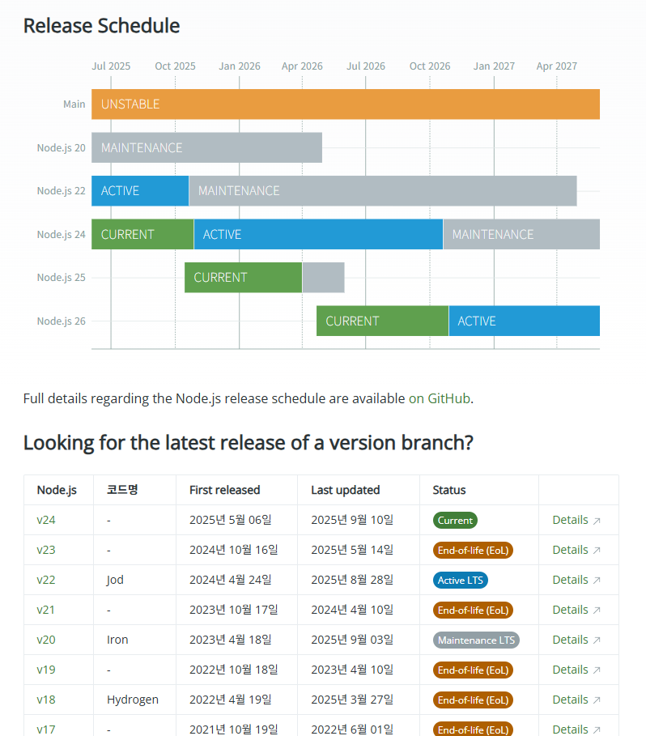

# Node.js 버전 업그레이드 회고

## Node.js 16 지원 종료

개발 중인 어플리케이션이 Node.js 16 버전을 사용하고 있었는데, 2023년 9월 11일에 [공식 종료](https://nodejs.org/en/blog/announcements/nodejs16-eol)되었다. 

종료된 건 알고 있긴 했지만, 당장 문제가 생기지 않아서 미뤄뒀었다.  
그런데 사용 중인 모듈들이 하나 둘, Node.js 16 지원을 중단하기 시작했다. T_T    
Quasar, AgGrid 등등...

결정적으로 업그레이드를 하게 된 계기는 playwright 와 MCP Server 이다. 
MCP Server Typescript SDK 가 Node.js 18 이상을 요구했고, playwright 역시 마찬가지였다.    

playwright 라이브러리 자체는 어찌저찌 구 버전을 사용하여 쓰기도 했지만,   
MCP Server를 사용할 때, 너무 불편했다.   

playwright 의 MCP Server 를 쓰려면 Node.js 18 이상 환경에서 MCP Server 를 띄우고,   
테스트할 내 어플리케이션을 별도로 Node.js 16 환경에서 띄워야 했다.

물론 개발 중인 어플리케이션의 MCP Server를 구현할 때도 마찬가지...

그래서 Node.js LTS 버전으로 업그레이드를 결심했다. 

## Node.js LTS로 업그레이드

 

- Current
    - 최신 기술이 포함된 버전
    - 시험적인 기능이 포함될 수 있어 안정성이 다소 떨어짐
- EOL
    - 더 이상 지원하지 않는 버전
    - 사용을 권장하지 않으며 보안 위험이 있을 수 있음
- LTS
    - 보안 업데이트 및 버그 수정 장기 제공
    - 안정적이고 검증된 버전
- Maintenance
    - LTS 이후의 단계로, 새로운 기능 추가는 없고 보안 패치와 버그 수정만 제공

 
이 글을 쓰는 시점은 Active LTS 가 22 버전인데, 곧 (약 한 달 뒤) 24 버전이 Active LTS 라 아직 고민 중에 있다. 

아마 24 버전으로 업그레이드 하게 되지 싶다.

## 의존성 버전 업그레이드

## Native Module 빌드 문제

## ejs, cjs 충돌 문제

