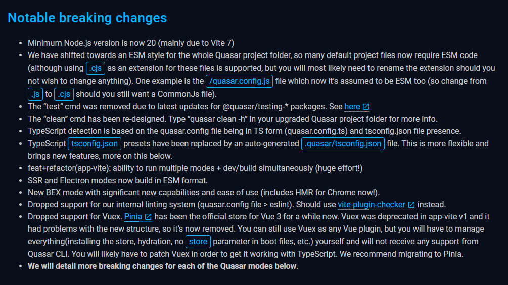

# Node.js 버전 업그레이드 회고

## Node.js 16 지원 종료

개발 중인 어플리케이션이 Node.js 16 버전을 사용하고 있었는데, 2023년 9월 11일에 [공식 종료](https://nodejs.org/en/blog/announcements/nodejs16-eol)되었다. 

종료된 건 알고 있긴 했지만, 당장 문제가 생기지 않아서 미뤄뒀었다.  
그런데 사용 중인 모듈들이 하나 둘, Node.js 16 지원을 중단하기 시작했다. T_T    
Quasar, AgGrid 등등...

결정적으로 업그레이드를 하게 된 계기는 playwright 와 MCP Server 이다.   
MCP Server Typescript SDK 가 Node.js 18 이상을 요구했고, playwright 역시 마찬가지였다.    

playwright 라이브러리 자체는 어찌저찌 구 버전을 사용하여 쓰기도 했지만,   
MCP Server를 사용할 때, 너무 불편했다.   

playwright 의 MCP Server 를 쓰려면 Node.js 18 이상 환경에서 MCP Server 를 띄우고,   
테스트할 내 어플리케이션을 별도로 Node.js 16 환경에서 띄워야 했다.

물론 개발 중인 어플리케이션의 MCP Server를 구현할 때도 마찬가지...

그래서 Node.js LTS 버전으로 업그레이드를 결심했다. 

## Node.js LTS로 업그레이드

 

- Current
    - 최신 기술이 포함된 버전
    - 시험적인 기능이 포함될 수 있어 안정성이 다소 떨어짐
- EOL
    - 더 이상 지원하지 않는 버전
    - 사용을 권장하지 않으며 보안 위험이 있을 수 있음
- LTS
    - 보안 업데이트 및 버그 수정 장기 제공
    - 안정적이고 검증된 버전
- Maintenance
    - LTS 이후의 단계로, 새로운 기능 추가는 없고 보안 패치와 버그 수정만 제공

 
이 글을 쓰는 시점은 Active LTS 가 22 버전인데, 곧 (약 한 달 뒤) 24 버전이 Active LTS 라 아직 고민 중에 있다. 

아마 최종적으로 24 버전으로 업그레이드 하게 되지 싶다.

## Quasar ejs, cjs 충돌 문제

- CommonJS (CJS)
    - `require()`와 `module.exports`를 사용
    - 모듈 로딩이 동기적
    - 파일 확장자: `.cjs` 또는 `.js`
    - Node.js 초창기부터 쓰던 방식이고, 동기적이라 서버 환경에 적합
    - 런타임에 모듈 로드
- ECMAScript Modules (ESM)
    - `import`와 `export`를 사용
    - 모듈 로딩이 비동기적
    - 파일 확장자: `.mjs` 또는 `.js` (package.json에서 "type": "module" 설정 시)
    - 자바스크립트 공식 표준이며, 브라우저와 최신 Node.js 에서 모두 잘 동작.
    - 트리 쉐이킹(tree-shaking) 지원으로 불필요한 코드 제거 가능
    - 컴파일/파싱 단계에서 모듈 구조 파악 가능

[Quasar 공식 문서의 Notable breaking changes](https://quasar.dev/quasar-cli-vite/upgrade-guide/#notable-breaking-changes) 를 보면, 프로젝트 전반을 ESM 스타일로 전환하고, Quasar Electron 이 ESM 으로 빌드되게 변경되었다고 한다.   

`@quasar/app-vite/tsconfig-preset` 가 삭제되었고, 자동 생성되는`./.quasar/tsconfig.json` 를 쓰라고 되어 있다.   
`tsconfig.json` 내부를 보면, 기존엔 ESM 으로 빌드되지만 commonjs 문법도 호환되게끔 되어 있었다면 새로운 버전은 좀 더 엄격하게 ESM 문법만 허용하게 되어 있다.

> Unless you really know what you are doing, drop any other configuration and just keep extends as the only option in the file.

모르면 시키는대로 다른 설정 날리고 프리셋되는 `tsconfig.json`을 `extends` 만 하라고 하길래, 군말 않고 따랐다.    
설정을 적용하자 commonjs 문법을 사용한 곳에 당연히 오류가 발생했다.

감사하게도 Quasar 공식 문서에 [해결 방법](https://quasar.dev/quasar-cli-vite/upgrade-guide/#beginning-of-the-upgrade-process)이 나와 있다.   

대부분의 충돌되는 상황이 설명되어 있어 해결하는 데 큰 문제 없었다.  
심지어 Copilot Agent 모드를 사용하여 거의 "딸깍"으로 수정했다. 

## 극변한 AgGrid의 호환성 문제

## Native Module 빌드 문제

## 마치며
